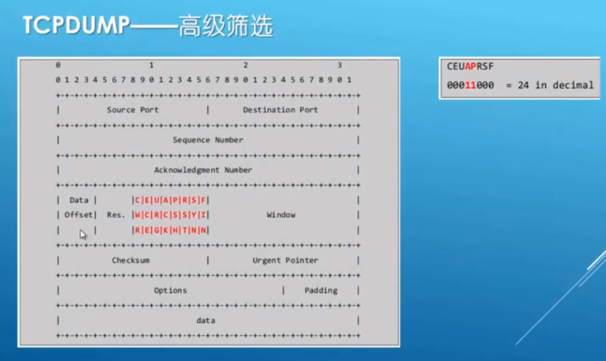

# tcpdump 使用

标签（空格分隔）： 渗透测试

---

* 抓包
  * 默认只抓68个字节。
  * tcpdump -i eth0 -s 0 -w file.pcap
  * tcpdump -i eth0 port 22
  * tcpdup -r file.pcap
* 筛选
  * tcpdump -n -r test.pcap | awk '{print $3}' | sort -u
  * tcpdump -nX dst host 114.114.114.114 -r test.pcap

* 高级筛选
  
  * tcpdump -n -A 'tcp[13]=24' -r test.pcap 